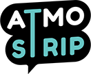

# Atmostrip (en cours)

Je collabore avec un [Graphiste](https://www.behance.net/MadMouseDesign) sur ce projet dont le concept est le sien. Je m'occupe pour l'instant de l'intégration de ses maquettes et par la suite tout le côté back-end. Je n'ai pas encore choisi de Framework, pour l'instant je penche plutôt vers Wordpress puisque mon collaborateur connaît ce CMS et qu'il ne touche pas une ligne de code.

## Concept

Atmostrip est un site communautaire qui rassemblera des créateurs et lecteurs de Webtoons.

Chacun pourra poster ses Webtoons, divisé par chapitre, avec la possibilité d'ajouter des sons d'ambiance et d'autres options viendront petit à petit.

Les lecteurs pourront s'abonner à une Webtoon ou un auteur, ils auront aussi la possibilité de lui faire un don.

Un site et une application Android sont prévus.

## [Preview](https://atmostrip.herokuapp.com/)
